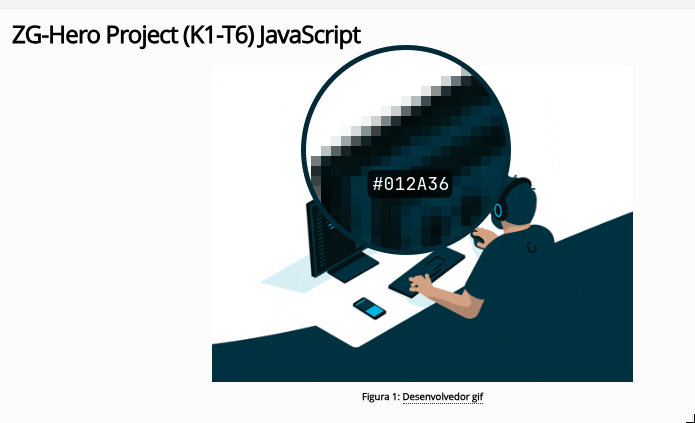

# Linketinder Front-End

Aplicação front-end em TypeScript para cadastrar candidatos, empresas e vagas, envolvendo suas competencias. Os dados e as curtidas são armazenados no `localStorage`; quando candidato e empresa curtem a mesma relação candidato–vaga, ocorre um match.
## Como executar
É necessário ter Node.js e npm instalados.
```bash

npm install

npm run dev

```
Abra no navegador o endereço exibido pelo Vite, normalmente `http://localhost:5173`.
Para verificar e gerar a versão de produção:
```bash
npm run build
npm run preview
```
## Arquitetura
> estrutura de pastas seguindo um princípio de mvc, gerada usando o comando `tree -I 'node_modules|dist|.git' -L 3` **e editado para melhor visualização**

### Responsabilidades
O ponto de entrada é `main.ts` que instancia `LinketinderApp()`(**orquestrador da parte backend**) e chama `renderAll()` para orquestrar o front. Cada **página/componente é responsável** pelos métodos necessários para o componente funcionar, por exemplo o `Header` contém *toggleSubmenu* que é uma função utilizada para o funcionamento correto do header.

### estilização
Como o módulo desse curso de TS e o contexto do desafio era focar no front-end, utilizei minha experiencia prévia de designer gráfico (confira aqui >> https://www.behance.net/athussilvasouza) pra tentar desenvolver um design limpo e agradável, utilizei regras de contraste para escolher as cores, mas me baseei na imagem do desafio (gosto muito de tons de azul). Usei essas regras e somado com o que aprendi no curso de html + css padronizei as cores e defini regras globais em `styles/global.css` e deixei as específicas no mesmo nível do componente/página. **Deixo claro que não utilizei react**. A imagem que me baseei para criar a paleta de cores:


#### Grafico de Skills
> utiliza biblioteca `chart.js` para criar um gráfico a partir de uma `Job`, e retorna um grafico de contagem de frequencia das competencias para aquela vaga

#### estrutura de pastas
```text
Linketinder-FrontEnd
├── public                     
│   └── assets              
├── README.md
├── src
│   ├── app
│   │   └── LinketinderApp.ts
│   ├── components
│   │   ├── Header.ts
│   ├── main.ts                 
│   ├── models/   
│   │   ├── Candidate.ts
│   │   ├── Company.ts
│   │   ├── Job.ts
│   │   ├── Like.ts
│   │   └── User.ts
│   ├── pages/
│   ├── renderAll.ts
│   ├── styles
│   │   └── global.css
│   ├── types
│   │   ├── AppState.ts
│   │   ├── EntityInputs.ts
│   │   └── UserType.ts
│   └── vite-env.d.ts
└── tsconfig.json

```

A interface é construída diretamente com a API do DOM. O `LinketinderApp` concentra as regras de negócio e o acesso ao `localStorage`,o `renderAll` controla a exibição e interação do usuário enquanto as páginas coordenam os componentes exibidos. Para gerar um id aleatório para estrutura de vaga utilizei o `crypto.randomUUID()`, que gera um id de forma segura. 
#### gitdiagram
> ferramenta para visualizar melhor e entender os fluxos, os links são clicáveis

```mermaid
%% Generated by https://gitdiagram.com/athus27/linketinder-frontend
flowchart TD

subgraph group_ui["Interface and navigation"]
  node_boot["App entry<br/>[main.ts]"]
  node_navigation["Page navigation<br/>[renderAll.ts]"]
  node_header["Menu header<br/>[Header.ts]"]
  node_info["Info section<br/>[InfoSection.ts]"]
end

subgraph group_profiles["Profiles and jobs"]
  node_registration["Registration page<br/>[RegisterPage.ts]"]
  node_userform["Profile form<br/>[UserForm.ts]"]
  node_candidatefeed["Candidate feed"]
  node_candidatecard["Candidate card"]
  node_companyfeed["Company feed<br/>[CompanyFeedPage.ts]"]
  node_companycard["Company card"]
  node_jobregister["Job registration<br/>[JobRegisterPage.ts]"]
  node_jobform["Job form<br/>[JobForm.ts]"]
  node_jobfeed["Job feed<br/>[JobFeedPage.ts]"]
  node_jobcard["Job card<br/>[JobProfileCard.ts]"]
end

subgraph group_matching["Likes and matches"]
  node_candidate_like["Candidate likes"]
  node_company_like["Company likes<br/>[CompanyLikePage.ts]"]
end

subgraph group_domain["Domain and persistence"]
  node_app["Business and storage<br/>[LinketinderApp.ts]"]
  node_models["Domain entities<br/>[Like.ts]"]
end

node_person(("Browser user"))
node_localstorage[("Browser localStorage")]

node_boot -->|"instantiates"| node_app
node_boot -->|"starts rendering"| node_navigation
node_person -->|"uses menu"| node_header
node_header -->|"invokes actions"| node_navigation
node_navigation -->|"creates"| node_header
node_navigation -->|"creates"| node_info
node_navigation -->|"selects page"| node_registration
node_navigation -->|"selects page"| node_candidatefeed
node_navigation -->|"selects page"| node_companyfeed
node_navigation -->|"selects page"| node_jobregister
node_navigation -->|"selects page"| node_jobfeed
node_navigation -->|"selects page"| node_candidate_like
node_navigation -->|"selects page"| node_company_like
node_registration -->|"coordinates"| node_userform
node_jobregister -->|"coordinates"| node_jobform
node_candidatefeed -->|"displays"| node_candidatecard
node_companyfeed -->|"displays"| node_companycard
node_jobfeed -->|"displays"| node_jobcard
node_userform -->|"creates profiles"| node_app
node_jobform -->|"creates jobs"| node_app
node_candidate_like -->|"submits candidate like"| node_app
node_company_like -->|"submits company like"| node_app
node_app -->|"uses entities"| node_models
node_app -->|"loads and saves"| node_localstorage

click node_boot "https://github.com/athus27/linketinder-frontend/blob/main/src/main.ts"
click node_navigation "https://github.com/athus27/linketinder-frontend/blob/main/src/renderAll.ts"
click node_header "https://github.com/athus27/linketinder-frontend/blob/main/src/components/Header.ts"
click node_info "https://github.com/athus27/linketinder-frontend/blob/main/src/components/InfoSection.ts"
click node_registration "https://github.com/athus27/linketinder-frontend/blob/main/src/pages/RegisterPage.ts"
click node_userform "https://github.com/athus27/linketinder-frontend/blob/main/src/components/UserForm.ts"
click node_candidatefeed "https://github.com/athus27/linketinder-frontend/blob/main/src/pages/CandidateFeedPage.ts"
click node_candidatecard "https://github.com/athus27/linketinder-frontend/blob/main/src/components/CandidateProfileCard.ts"
click node_companyfeed "https://github.com/athus27/linketinder-frontend/blob/main/src/pages/CompanyFeedPage.ts"
click node_companycard "https://github.com/athus27/linketinder-frontend/blob/main/src/components/CompanyProfileCard.ts"
click node_jobregister "https://github.com/athus27/linketinder-frontend/blob/main/src/pages/JobRegisterPage.ts"
click node_jobform "https://github.com/athus27/linketinder-frontend/blob/main/src/components/JobForm.ts"
click node_jobfeed "https://github.com/athus27/linketinder-frontend/blob/main/src/pages/JobFeedPage.ts"
click node_jobcard "https://github.com/athus27/linketinder-frontend/blob/main/src/components/JobProfileCard.ts"
click node_candidate_like "https://github.com/athus27/linketinder-frontend/blob/main/src/pages/CandidateLikePage.ts"
click node_company_like "https://github.com/athus27/linketinder-frontend/blob/main/src/pages/CompanyLikePage.ts"
click node_app "https://github.com/athus27/linketinder-frontend/blob/main/src/app/LinketinderApp.ts"
click node_models "https://github.com/athus27/linketinder-frontend/blob/main/src/models/Like.ts"

classDef toneNeutral fill:#f8fafc,stroke:#334155,stroke-width:1.5px,color:#0f172a
classDef toneBlue fill:#dbeafe,stroke:#2563eb,stroke-width:1.5px,color:#172554
classDef toneAmber fill:#fef3c7,stroke:#d97706,stroke-width:1.5px,color:#78350f
classDef toneMint fill:#dcfce7,stroke:#16a34a,stroke-width:1.5px,color:#14532d
classDef toneRose fill:#ffe4e6,stroke:#e11d48,stroke-width:1.5px,color:#881337
classDef toneIndigo fill:#e0e7ff,stroke:#4f46e5,stroke-width:1.5px,color:#312e81
classDef toneTeal fill:#ccfbf1,stroke:#0f766e,stroke-width:1.5px,color:#134e4a
class node_boot,node_navigation,node_header,node_info,node_person toneBlue
class node_registration,node_userform,node_candidatefeed,node_candidatecard,node_companyfeed,node_companycard,node_jobregister,node_jobform,node_jobfeed,node_jobcard,node_localstorage toneAmber
class node_candidate_like,node_company_like toneMint
class node_app,node_models toneRose
```

